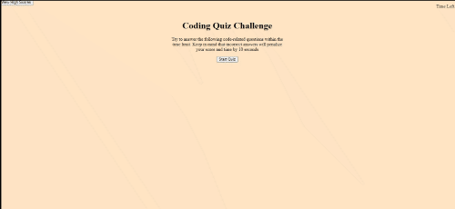

# Coding Quiz

For this project, the goal is to create a timed quiz that stores the user's high scores in local storage. The quiz is setup so that when the user answers a question, the next question is immediately presented to the user. And when a question is incorrectly answered, time is then subtracted from the clock. The game is then over when the user answers all the questions or the timer reaches 0. The user is then able to enter in one's initials and the high score would be saved.

## Demo

The following animation demonstrates the application functionality.

## Built With

* [HTML](https://developer.mozilla.org/en-US/docs/Web/HTML)
* [CSS](https://developer.mozilla.org/en-US/docs/Web/CSS)
* [Javascript](https://developer.mozilla.org/en-US/docs/Web/JavaScript)

## Deployed Link

* [See Live Site](https://dazedchou.github.io/CodeQuiz/)

## Authors

* **David Chou** 

- [Link to Portfolio Site](https://dazedchou.github.io/My-Portfolio/)
- [Link to Github](https://github.com/)
- [Link to LinkedIn](https://www.linkedin.com/)

## License

This project is licensed under the MIT License 

